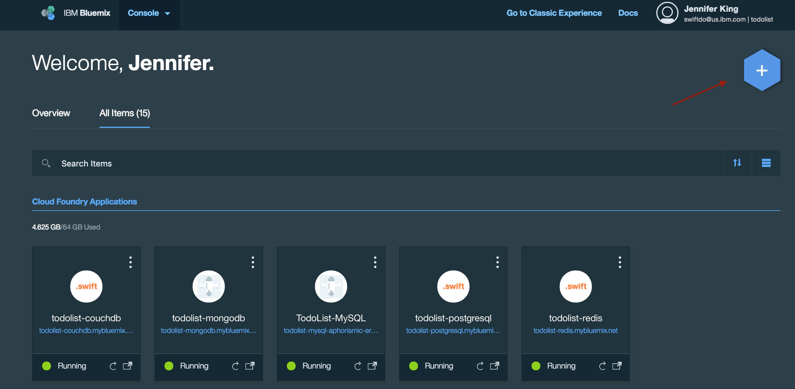
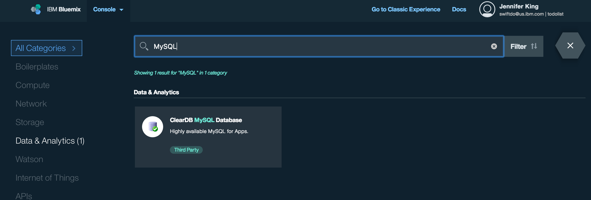
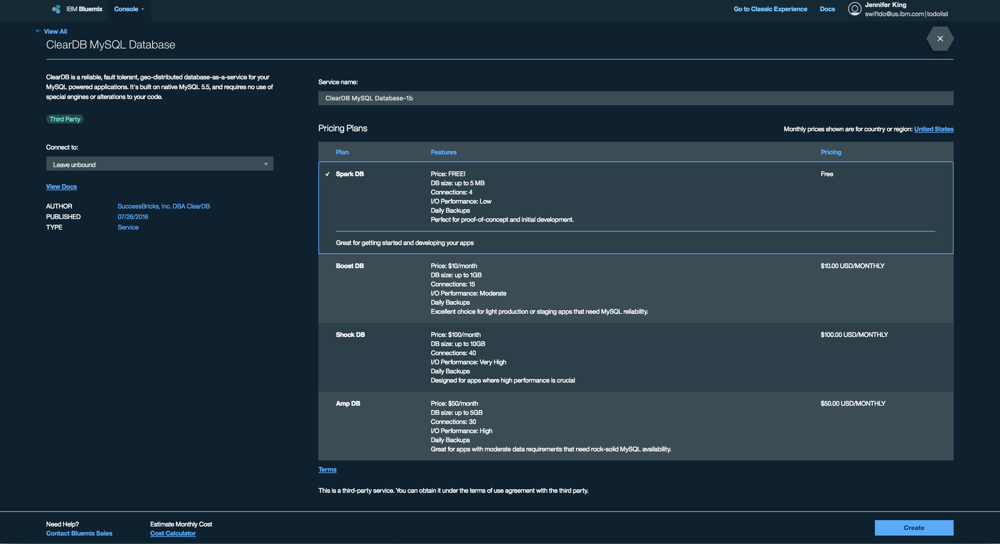
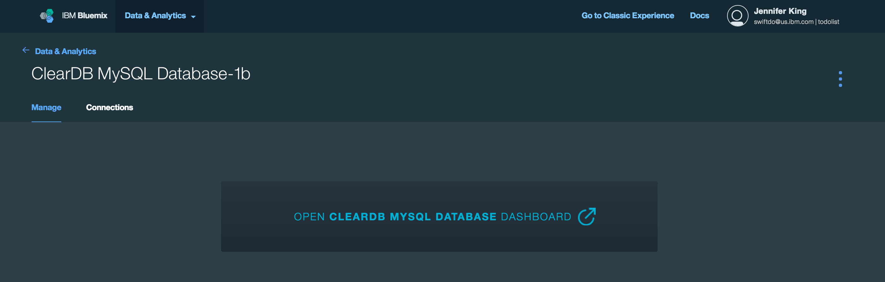
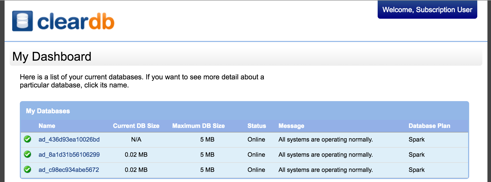
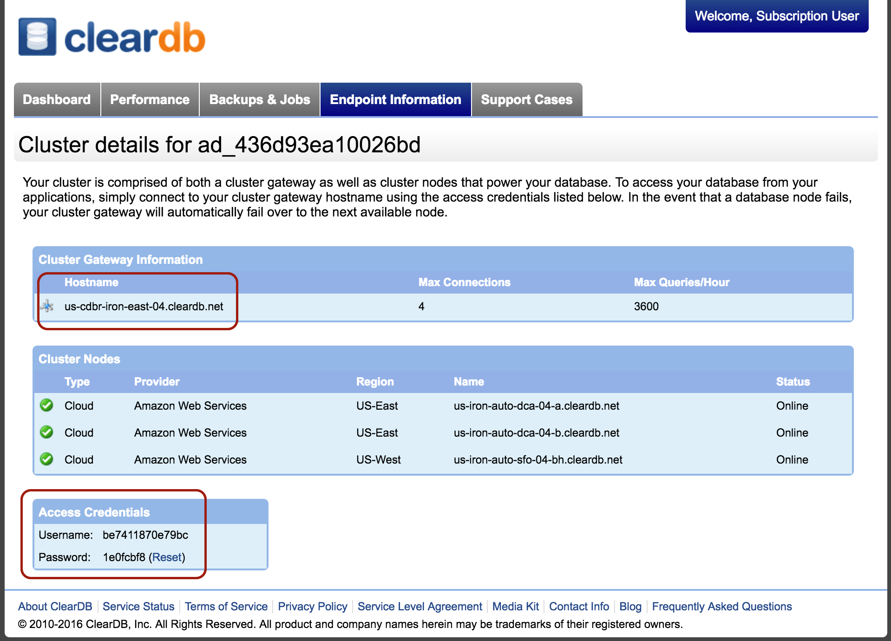
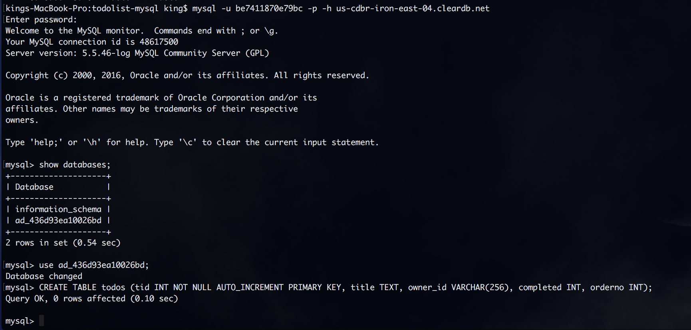

# TodoList MySQL

[](https://travis-ci.org/IBM-Swift/TodoList-MySQL)
[](https://swift.org/download/#snapshots)


## Table of Contents
* [Summary](#summary)
* [Quick start](#quick-start)
* [Setup MySQL service](#setup-mysql-service)
* [Deploy to Bluemix](#deploy-to-bluemix)
* [Test](#test)

## Summary

A MySQL implementation of the [TodoList](https://github.com/IBM-Swift/todolist-boilerplate)

## Quick start for developing locally on macOS:

1. Download the [Swift DEVELOPMENT 06-20 snapshot](https://swift.org/download/#snapshots)
2. Clone the TodoList MySQL repository 
 
  `git clone https://github.com/IBM-Swift/todolist-mysql`

3. Install and start MySQL

  ```
  brew install mysql
  brew link mysql
  mysql.server start
  ```
  
4. Link MySQL during swift build

  `swift build -Xswiftc -I/usr/local/include/mysql -Xlinker -L/usr/local/lib`

-I tells the compiler where to find the MySQL header files, and -L tells the linker where to find the library. This is required to compile and run on macOS.

- Create your database table:

 `mysql -u root -p`

  ```sql 
  CREATE DATABASE todolist;
  USE todolist;
  CREATE TABLE todos (tid INT NOT NULL AUTO_INCREMENT PRIMARY KEY, title TEXT, owner_id VARCHAR(256), completed INT, orderno INT);
  ```
 
5. Open the [TodoList Client](http://www.todobackend.com/client/index.html?http://localhost:8090)

## Setup MySQL service and database table in Bluemix

1. Login to your [Bluemix](https://new-console.ng.bluemix.net/?direct=classic) account (create an account, if necessary)  

2. Open the Bluemix catalog by clicking the blue hexagon '+' icon
  

3. Search for "MySQL" and open the ClearDB MySQL Database
  

4. Select the (free) Spark DB plan and click the Create button. 
  
  You will now have a provisioned ClearDB MySQL Database in your services.
  

5. Click “open ClearDB MySQL Database dashboard”
  

6. You now need to create your new todos table in the default database that was automatically created for you.  Open the database and navigate to the “Endpoint Information” tab to find your credentials. Note your hostname, username and password.
  

7. Create your database table from the command line with the following commands:

  ```
  mysql -u <username> -p -h <hostname>
  ```
You’ll be prompted for your password
  ```
  show databases;
  use <your database>;
  CREATE TABLE todos (tid INT NOT NULL AUTO_INCREMENT PRIMARY KEY, title TEXT, owner_id VARCHAR(256), completed INT, orderno INT);
  ```
  

## Deploying to Bluemix

1. Login to your [Bluemix](https://new-console.ng.bluemix.net/?direct=classic) account (create an account, if necessary) 

2. Download and install the [Cloud Foundry tools](https://new-console.ng.bluemix.net/docs/starters/install_cli.html):
```
cf login
bluemix api https://api.ng.bluemix.net
bluemix login -u username -o org_name -s space_name
```

    Be sure to change the directory to the todolist-mongodb directory where the manifest.yml file is located.

3. Run `cf push`

    #### Note: The uploading droplet stage should take several minutes. If it worked correctly, it should say:
```
2 of 2 instances running
App started
```


## Compile and run tests:

1. Clone the Tests to your project:

  `git clone https://github.com/IBM-Swift/todolist-tests Tests`

2. Build the project: 

  `swift build -Xcc -I/usr/local/include -Xlinker -L/usr/local/lib`

3. Run the tests:

  `swift test`
